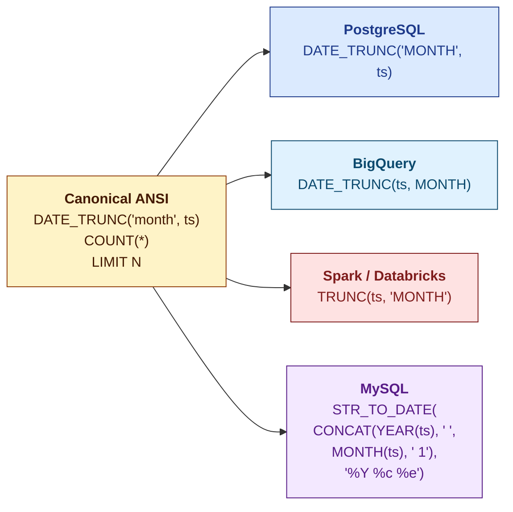
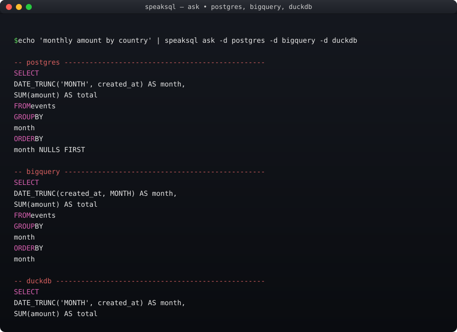
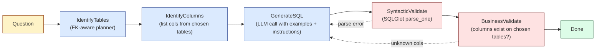
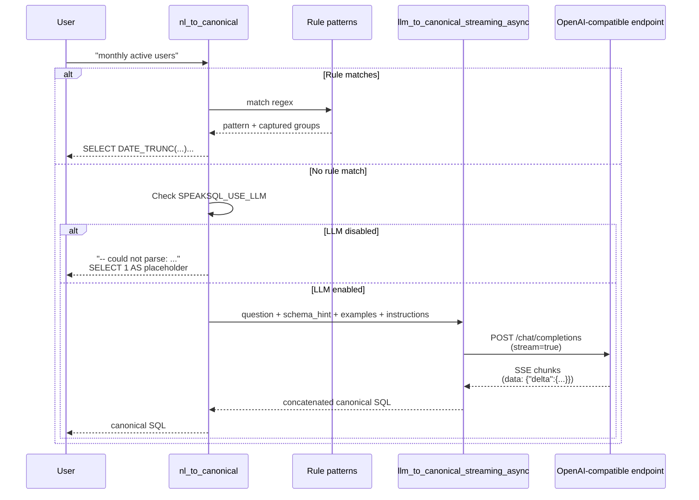
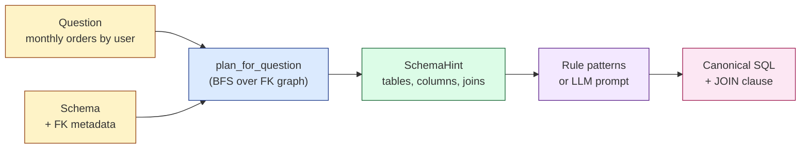
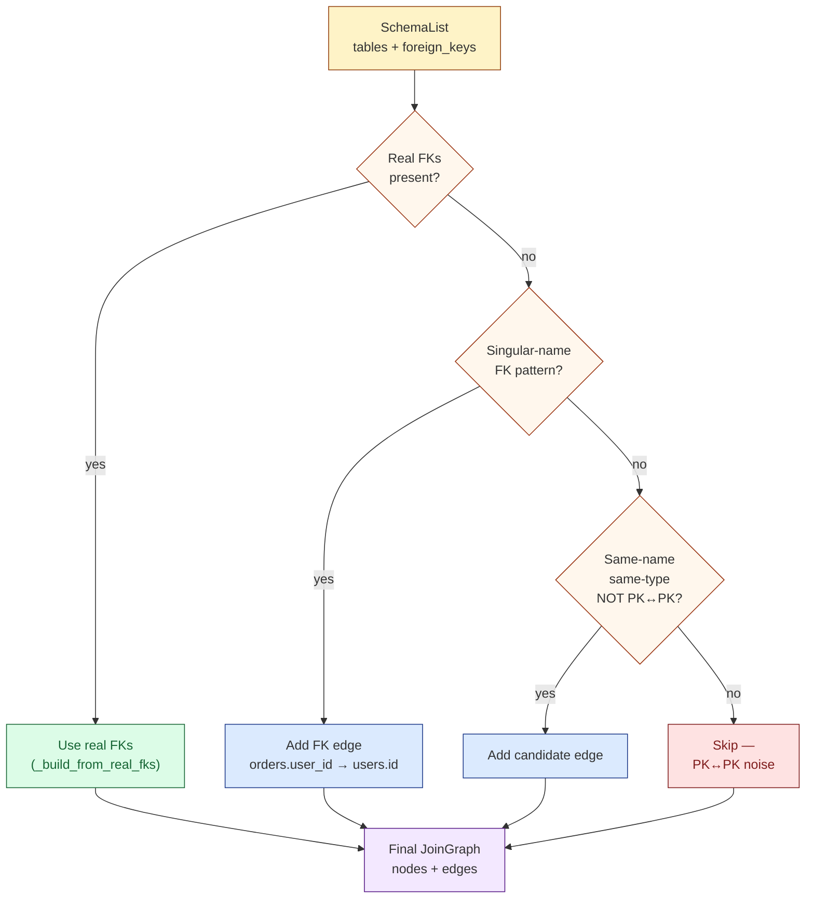
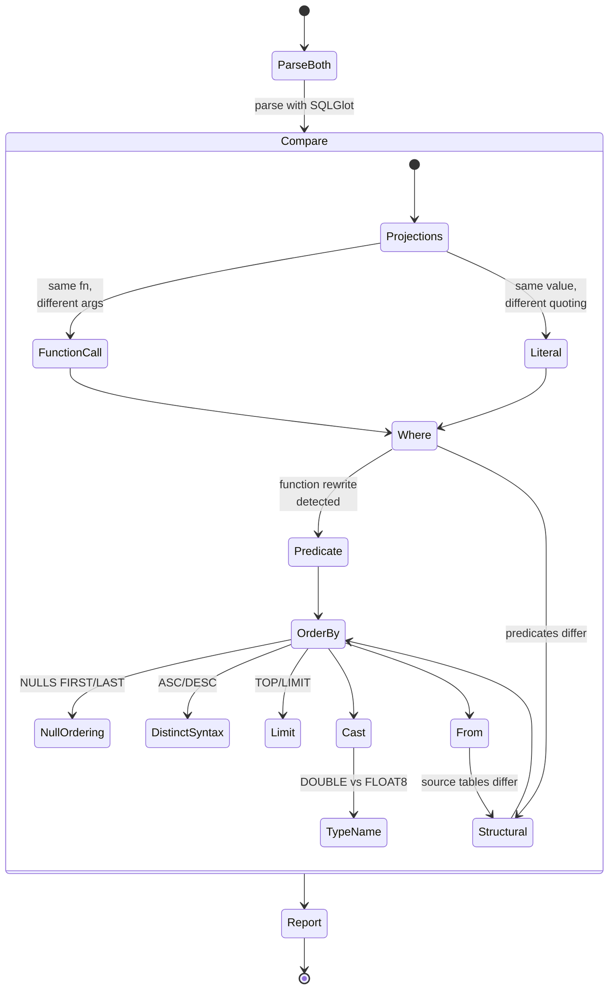

# SpeakSQL

> **Speak once. Query any dialect.**

A dialect-aware SQL transpiler for Python. Write one canonical ANSI query,
get correct syntax for **PostgreSQL, MySQL, SQL Server, Snowflake,
BigQuery, Databricks, DuckDB, SQLite,** and **SAP HANA** — plus a
Fabric-style NL→SQL pipeline with example retrieval, per-source
instructions, and a multi-step state-machine planner.

[](https://github.com/rollroyces/speaksql/actions/workflows/ci.yml)
[](https://github.com/rollroyces/speaksql)
[](LICENSE)
[](https://github.com/tobymao/sqlglot)
[](https://github.com/rollroyces/speaksql)

---

## The 30-second pitch



One canonical source → four dialect-specific outputs, with no
copy-paste and no dialect-specific debugging. Built on SQLGlot; adds
the Fabric-style NL2SQL pipeline, FK-aware planning, JOIN graph
visualization, and vendor-specific fixups.

---

## See it in action

<https://rollroyces.github.io/speaksql/demo.html> ships four
**interactive terminal recordings** (asciinema v2) — actual captured
sessions, no animations. Click the page, hit play, watch the CLI
run live in your browser. The recordings are also re-generated by CI
on every push from `scripts/record_demo.py`.

<div align="center">



</div>

You can also replay them locally:

```bash
uv run --no-sync python scripts/record_demo.py /tmp/demo.cast demo
# open /tmp/demo.cast in any asciinema player
```

---

## Install

```bash
pip install speaksql
```

**With extras** (you'll want one of these for live databases):

```bash
pip install speaksql[service]   # FastAPI + Uvicorn for the HTTP service
pip install speaksql[duckdb]    # in-process DuckDB driver (great for tests)
pip install speaksql[postgres]  # psycopg driver
pip install speaksql[mysql]     # PyMySQL driver
pip install speaksql[mssql]     # pymssql driver (SQL Server)
pip install speaksql[snowflake] # snowflake-connector-python
pip install speaksql[bigquery]  # google-cloud-bigquery
pip install speaksql[spark]     # PySpark (heavy; JVM required)
pip install speaksql[backends]  # all seven drivers above
pip install speaksql[dev]       # pytest + ruff + mypy
```

---

## Quick start

### As a library — transpile once, emit everywhere

```python
import speaksql

canonical = (
    "SELECT DATE_TRUNC('month', created_at) AS month, "
    "       country, SUM(amount) AS total "
    "FROM events "
    "GROUP BY month, country "
    "ORDER BY month, total DESC"
)

result = speaksql.transpile(
    canonical,
    targets=("postgres", "bigquery", "snowflake", "tsql", "duckdb"),
)
for dialect, sql in result.items():
    print(f"--- {dialect} ---\n{sql}\n")
```

**Real output for `postgres`:**

```sql
SELECT
  DATE_TRUNC('MONTH', created_at) AS month,
  country,
  SUM(amount) AS total
FROM events
GROUP BY
  month,
  country
ORDER BY
  month,
  total DESC
```

### As a CLI — NL by default

```bash
$ echo "monthly amount by country" | speaksql ask -d postgres -d bigquery -d duckdb
-- postgres ------------------------------------------------
SELECT
  DATE_TRUNC('MONTH', created_at) AS month,
  SUM(amount) AS total
FROM events
GROUP BY
  month
ORDER BY
  month NULLS FIRST

-- bigquery ------------------------------------------------
SELECT
  DATE_TRUNC(created_at, MONTH) AS month,
  SUM(amount) AS total
FROM events
GROUP BY
  month
ORDER BY
  month

-- duckdb --------------------------------------------------
SELECT
  DATE_TRUNC('MONTH', created_at) AS month,
  SUM(amount) AS total
FROM events
GROUP BY
  month
ORDER BY
  month NULLS FIRST
```

The CLI takes **natural language by default** — no `--sql` flag needed
for plain English. Canonical SQL is auto-detected when the input starts
with a SQL keyword.

```bash
# Pretty-print / canonicalize SQL
echo "select    a,b, c  FROM tbl WHERE x=1" | speaksql format --target postgres
# → SELECT a, b, c FROM tbl WHERE x = 1

# Pretty mode keeps the multi-line form
speaksql format --pretty \
  "SELECT id, name FROM users WHERE active = true ORDER BY id LIMIT 10"

# Compare two SQL strings semantically (NULLS, ASC/DESC, function rewrites)
speaksql diff \
  "SELECT id FROM t ORDER BY id ASC NULLS LAST" \
  "SELECT id FROM t ORDER BY id ASC" --json

# Interactive loop: type NL/SQL, get per-dialect output, switch at runtime
speaksql repl --dialect duckdb --dialect postgres --db-path sales.db

# Build a JOIN graph from a SQLite file
speaksql graph ./analytics.sqlite --html ./graph.html

# List supported dialect identifiers
speaksql dialects
```

| Subcommand | Purpose |
|---|---|
| `ask` | Transpile NL or canonical SQL to one or more dialects; optionally execute on a live backend |
| `format` | Pretty-print or canonicalize SQL; convert between dialects without an LLM |
| `diff` | Compare two SQL strings semantically (NULLS, ASC/DESC, function rewrites, type aliases) |
| `graph` | Build a JOIN graph from a SQLite/DuckDB file; emit JSON, text, or HTML |
| `repl` | Interactive loop: NL/SQL input → per-dialect output, `:dialects` to switch, `:quit` to exit |
| `dialects` | Print all supported dialect identifiers |

### As a service — FastAPI

```bash
pip install speaksql[service]
uvicorn speaksql.service:app --reload
```

```bash
# NL input
curl -X POST http://localhost:8000/v1/ask \
  -H 'content-type: application/json' \
  -d '{"question": "monthly amount by country",
       "dialects": ["postgres", "snowflake", "bigquery"]}'

# Canonical SQL input
curl -X POST http://localhost:8000/v1/ask \
  -H 'content-type: application/json' \
  -d '{"question": "SELECT 1 AS x",
       "is_sql": true, "dialects": ["postgres", "duckdb"]}'

# Transpile + execute on a live backend
curl -X POST http://localhost:8000/v1/execute \
  -H 'content-type: application/json' \
  -d '{"question": "SELECT SUM(amount) AS total FROM events",
       "is_sql": true, "backend": "duckdb", "db_path": "/tmp/events.duckdb"}'

# Liveness + schema introspection
curl http://localhost:8000/v1/health
curl 'http://localhost:8000/v1/schema?db=sqlite&db_path=sales.db'
```

**Streaming via WebSocket** — connect to `ws://localhost:8000/v1/ask`,
send the same JSON payload, and receive frames as the canonical SQL is
built and per-dialect transpilation completes. The LLM stream is bridged
onto the event loop via a thread executor + queue, so blocking HTTP reads
don't stall other WebSocket connections.

```text
client → server: {"question": "monthly active users"}
server → client: {"type": "llm_token", "delta": "SELECT "}
server → client: {"type": "llm_token", "delta": "DATE_TRUNC("}
... (more llm_token frames if SPEAKSQL_USE_LLM=1 and rule layer missed)
server → client: {"type": "canonical",  "sql": "SELECT ..."}
server → client: {"type": "transpile", "dialect": "postgres", "sql": "..."}
server → client: {"type": "transpile", "dialect": "snowflake", "sql": "..."}
server → client: {"type": "done"}
```

| Endpoint | Method | Purpose |
|---|---|---|
| `/v1/ask` | POST | Transpile NL or canonical SQL to one or more dialects |
| `/v1/ask` | WebSocket | Streaming variant — `llm_token` / `canonical` / `transpile` / `done` frames |
| `/v1/execute` | POST | Transpile + execute on a live backend (sqlite / duckdb / postgres / mysql / mssql / snowflake / bigquery / spark) |
| `/v1/diff` | POST | Semantic diff between two SQL strings |
| `/v1/graph` | POST | JOIN graph + `suggested_fks` for a SQLite/DuckDB file |
| `/v1/schema` | GET | Introspect a DB and return its schema as JSON |
| `/v1/dialects` | GET | List supported dialect identifiers |
| `/v1/health` | GET | Liveness probe (version + status) |

---

## The Fabric-style NL2SQL pipeline

SpeakSQL ships the same three pieces Microsoft ships for the Fabric
data agent — without the Azure lock-in, and applied to **multi-dialect**
emission. They layer cleanly: pick as many or as few as you want.

### 1. Rule layer (default, zero-config)

The `speaksql.nl` module ships three regex patterns: `count of X`,
`top N X by Y`, `monthly X by Y`. When a query matches, the LLM is
bypassed entirely. When it doesn't, the rule layer returns a
syntactically valid placeholder with the original question preserved
as a comment. **No fabrication.**

### 2. Example-query library (Fabric "example queries" → RAG)

Build a JSONL file of `(question, sql)` pairs that reflect your
business vocabulary. At NL→SQL time the top-K matches by **BM25** (no
external API) are injected as few-shot examples into the LLM system
prompt.

```bash
speaksql ask "monthly revenue by country" \
  --examples examples/example_library.jsonl
```

```jsonl
{"question": "monthly revenue", "sql": "SELECT DATE_TRUNC('month', created_at) AS month, SUM(amount) AS revenue FROM events GROUP BY month ORDER BY month", "tags": ["date_trunc", "revenue"]}
{"question": "top 5 revenue by country", "sql": "SELECT country, SUM(revenue) FROM events GROUP BY country ORDER BY SUM(revenue) DESC LIMIT 5", "tags": ["top_n"]}
```

For higher recall on longer queries, swap BM25 for an embedding
retriever via any OpenAI-compatible endpoint:

```python
from speaksql.examples import EmbeddingRetriever
from speaksql.llm import OpenAICompatibleProvider

retriever = EmbeddingRetriever(
    OpenAICompatibleProvider(
        base_url="https://api.openai.com/v1",
        model="text-embedding-3-small",
    )
)
hits = retriever.retrieve("active enterprise customers in Q4", library, top_k=3)
```

### 3. Per-source instructions

A plain-text file with rules that travel with the data source — the
Fabric "data source instructions" feature:

```bash
speaksql ask "show me last quarter's bookings" \
  --instructions ./sales-db-rules.txt \
  --db-path ./sales.db
```

The instructions file is appended to the LLM system prompt under a
`## Instructions` header so the model sees them after the schema
context block.

### 4. Multi-step planner (`advanced`)

For higher accuracy, the `advanced` mode runs a state machine:
**IdentifyTables → IdentifyColumns → GenerateSQL → SyntacticValidate
→ BusinessValidate**, with self-correction on parse errors and
column-reference errors up to a configurable retry budget. Inspired
by Fabric's "Advanced NL2SQL" and the Semantic Kernel Process
Framework.



```bash
speaksql ask "users who never placed an order" \
  --db-path ./sales.db --advanced
```

```python
from speaksql.planner import run_planner

result = run_planner(
    "users who never placed an order",
    advanced=True,
    schema=schema,
    instructions="Treat NULL refunds as zero",
    examples=few_shots,
    max_retries=2,
)
print(result.state.canonical_sql)
print(result.state.stages_run)   # ['identify_tables', ..., 'business_validate']
```

### Streaming fallback to LLM

When the rule layer misses and `SPEAKSQL_USE_LLM=1` is set, the LLM
takes over. The streaming path is bridged onto the event loop so
WebSocket clients see LLM tokens as they arrive.



```bash
export SPEAKSQL_USE_LLM=1
export SPEAKSQL_LLM_BASE_URL=https://api.openai.com/v1
export SPEAKSQL_LLM_API_KEY=sk-...        # or OPENAI_API_KEY
export SPEAKSQL_LLM_MODEL=gpt-4o-mini
export SPEAKSQL_LLM_AUTH_HEADER=x-api-key  # for Anthropic-style endpoints
export SPEAKSQL_LLM_TIMEOUT_S=30
export SPEAKSQL_LLM_MAX_TOKENS=512
export SPEAKSQL_LLM_TEMPERATURE=0.0
```

---

## FK-aware SQL generation

When you give SpeakSQL a real schema (via `Backend.introspect()` +
`foreign_keys()`), the rule-based planner becomes schema-aware: it
tokenizes the question, matches tokens against table and column names,
uses the FK metadata to pull in parent tables, and emits canonical SQL
with the right JOINs.



The same hint is fed back into the LLM system prompt when the rule
layer misses, so the LLM also benefits from the FK metadata. BFS over
the FK graph handles **multi-hop** paths — a question naming
`users` + `order_items` (no direct FK) automatically pulls in
`orders` as a bridge.

```python
from speaksql.backends import backend_for
from speaksql.schema_aware import plan_for_question, joins_to_sql

be = backend_for("duckdb", path="./analytics.duckdb")
schema = be.introspect().with_foreign_keys(be.foreign_keys())
be.close()

hint = plan_for_question("monthly orders by user", schema)
print(hint.to_prompt_section())
# Tables:
#   orders ((no columns matched))
#   users ((no columns matched))
# Joins:
#   orders.user_id → users.id
```

---

## JOIN graph

Given a schema, SpeakSQL builds a JOIN graph by **preferring real FK
constraints** and falling back to a name heuristic. The HTML output is
self-contained (no JS, no external CSS, no CDN) and embeds an SVG
diagram plus a column listing.

**A real ecommerce schema** (users, orders, products, order_items,
shipments, reviews) — rendered from the FK constraints the database
declares:

<p align="center">
  <a href="docs/join_graph_example/index.html">
    
  </a>
</p>



`suggest_fks()` returns FK candidates the user didn't declare, with a
confidence score and a reason string. Useful when a schema doesn't have
real constraints and you want a checklist of "likely FKs" to review.

```python
from speaksql.graph import suggest_fks

for s in suggest_fks(schema):
    print(f"{s.confidence:.1f}  {s.from_table}.{s.from_column} → {s.to_table}.{s.to_column}")
    print(f"           {s.reason}")
# 0.9  order_items.order_id → orders.id
#           'order_id' matches 'order_id' pattern; orders.id is PK
# 0.9  orders.user_id → users.id
#           'user_id' matches 'user_id' pattern; users.id is PK
```

Per-backend FK sources:

1. **Real FK constraints (preferred):** SQLite `PRAGMA foreign_key_list`,
   Postgres `information_schema.referential_constraints`, DuckDB
   `duckdb_constraints()`, Snowflake `information_schema` (often empty).
   BigQuery has no FK concept and returns `()`.
2. **Name-based heuristic (fallback):** when no FKs are available, we
   look for `{singular(other)}_id` matching the other table's PK.
   PK↔PK same-name noise is filtered out. Type mismatches disqualify.

---

## Vendor function overrides

SQLGlot is correct ~95% of the time. The other 5% — cross-dialect
date functions, vendor-specific NULL handling, HANA's quirky argument
order — is where `vendor_overrides` comes in. After SQLGlot emits
SQL, we walk a registry of per-dialect override functions that fix
specific broken patterns.

Example: `DATEDIFF('second', start_at, end_at)` on DuckDB. SQLGlot
emits this as

```sql
DATE_DIFF('END_AT', start_at, CAST('second' AS DATE))
```

The args are swapped (`END_AT` is now first because SQLGlot treats it
as a bare identifier, the unit ended up in a `CAST(...)`), and the
result is a runtime error. The `vendor_overrides._duckdb_datediff`
override recognizes the pattern and rewrites it to

```sql
DATE_DIFF('second', start_at, end_at)
```

which DuckDB executes correctly.

**Adding your own override** is a one-line registration:

```python
from speaksql.vendor_overrides import register

@register("bigquery")
def my_bigquery_fix(sql: str) -> str:
    # Replace vendor-specific syntax that SQLGlot gets wrong
    return sql.replace("OLD", "NEW")
```

Overrides are pure functions `(sql: str) -> str`, idempotent, and
applied in registration order. Built-in fixes ship for DuckDB
DATEDIFF, Postgres SECONDS_BETWEEN / DAYS_BETWEEN / ADD_MONTHS, and
Snowflake ADD_MONTHS.

---

## Semantic diff

Compare two SQL strings (possibly from different dialects) and see the
**semantic** differences — not just textual ones:



Categories detected: `function_call`, `null_ordering`,
`distinct_syntax`, `type_name`, `literal`, `predicate`, `structural`.

```python
import speaksql

diffs = speaksql.semantic_diff(
    "SELECT id FROM t ORDER BY id ASC NULLS LAST",
    "SELECT id FROM t ORDER BY id ASC",
    dialect_a="postgres", dialect_b="bigquery",
)
print(speaksql.format_diff(diffs))
# 1 semantic difference(s):
#   1. [null_ordering] @ ORDER BY #0
#      a: 'NULLS LAST'
#      b: 'NULLS FIRST'  (null ordering differs)
```

---

## Supported dialects

| Dialect | Identifier | Aliases | Live backend | Live FK introspection |
|---|---|---|---|---|
| PostgreSQL | `postgres` | — | ✅ | ✅ `information_schema.referential_constraints` |
| MySQL | `mysql` | — | ✅ PyMySQL | ✅ `information_schema.key_column_usage` |
| SQL Server | `tsql` | `mssql`, `sqlserver` | ✅ pymssql | ✅ `sys.foreign_keys` |
| Snowflake | `snowflake` | — | ✅ `snowflake-connector` | ⚠️ often empty |
| BigQuery | `bigquery` | — | ✅ `google-cloud-bigquery` | ❌ no FK concept in BigQuery |
| Databricks / Spark | `spark` | `databricks` | ✅ PySpark | ❌ Spark catalog doesn't expose FKs |
| DuckDB | `duckdb` | — | ✅ in-process | ✅ `duckdb_constraints()` |
| SQLite | `sqlite` | — | ✅ bundled | ✅ `PRAGMA foreign_key_list` |
| SAP HANA | `hana` | `saphana` | vendor dialect | ❌ not yet exposed |

### SAP HANA

SpeakSQL ships a vendor-side HANA dialect
(`src/speaksql/dialects/hana.py`) that subclasses SQLGlot's Postgres
parser. Upstream SQLGlot does not yet ship a HANA dialect, so we
maintain one locally:

- Inherits Postgres grammar (HANA is broadly ANSI-compatible)
- Removes Postgres's 2-arity `MAP` binding — HANA's `MAP(k1, v1, k2, v2, ...)`
  takes variable even-arity pairs
- Roundtrips HANA-specific functions through unchanged: `ADD_MONTHS`,
  `DAYS_BETWEEN`, `SECONDS_BETWEEN`, `SERIES_GENERATE_DATE`,
  `BINNING`, `TO_VARCHAR`, `IFNULL`

When upstream SQLGlot ships a real HANA dialect, this module either
inherits from it or becomes a thin shim — callers don't notice.

---

## Architecture

```mermaid
flowchart TB
    Q["NL question<br/>or canonical SQL"]:::input
    I1[introspect():<br/>tables + columns]:::core
    I2[foreign_keys():<br/>FK constraints]:::core
    L["FK-aware planner<br/>(plan_for_question)"]:::plan
    C["Canonical Plan<br/>(dialect-agnostic AST)"]:::plan
    E["SQLGlot transpile<br/>+ vendor_overrides"]:::emit
    H["HANA dialect<br/>(local Postgres subclass)"]:::vendor

    Q --> L
    I1 --> L
    I2 --> L
    L --> C
    C --> E
    E --> H

    E --> PG[(PostgreSQL)]:::out
    E --> MY[(MySQL)]:::out
    E --> TS[(T-SQL)]:::out
    E --> SF[(Snowflake)]:::out
    E --> BQ[(BigQuery)]:::out
    E --> SP[(Spark)]:::out
    E --> DU[(DuckDB)]:::out
    E --> SQ[(SQLite)]:::out
    E --> HA[(SAP HANA)]:::out

    Q -.opt-in.-> LL["LLM Planner<br/>(examples + instructions)"]:::tool
    C -.-> DF["Semantic Diff"]:::tool
    I1 -.fk.-> JG["JOIN Graph<br/>(real FKs → heuristic)"]:::tool
    I2 -.fk.-> JG

    classDef input fill:#fef3c7,stroke:#92400e
    classDef core fill:#dbeafe,stroke:#1e3a8a
    classDef plan fill:#dcfce7,stroke:#166534
    classDef emit fill:#f3e8ff,stroke:#581c87
    classDef vendor fill:#fce7f3,stroke:#9d174d
    classDef out fill:#f5f5f4,stroke:#57534e
    classDef tool fill:#e0f2fe,stroke:#0c4a6e
```

The canonical plan is dialect-agnostic — you write ANSI SQL once. The
vendor dialect modules are narrow: only the things SQLGlot misses
(HANA's `MAP` arity, T-SQL edge cases, BigQuery FK-less introspection).
The rest of the work is done by SQLGlot.

Three orthogonal tools complement the transpile pipeline:

- **LLM planner** — replaces the rule-based NL layer when
  `SPEAKSQL_USE_LLM=1`. Stdlib `urllib`, no SDK, OpenAI-compatible.
- **Semantic diff** — compares two SQL strings AST-aware.
- **JOIN graph** — uses real FKs first, name heuristic second.
  Self-contained HTML output.

---

## Honest about limits

- **HANA** is a vendor dialect, not a SQLGlot upstream one. We
  subclass Postgres; long-term HANA-specific parsing should move
  upstream.
- **BigQuery** has no FK concept in its DDL, so the FK introspection
  layer returns `()` and we fall back to the name heuristic. The
  heuristic is reasonable but not perfect.
- **Snowflake** FK introspection is informational only and often
  returns empty in production warehouses; same fallback applies.
- **No fabrication in NL→SQL.** If the rule layer misses and the LLM
  is disabled, we return a syntactically valid placeholder with the
  original question preserved as a comment, not a hallucinated query.
- **LLM accuracy depends on the model and your example library.** A
  well-curated 50-pair library usually outperforms a generic model on
  a single few-shot prompt. The eval harness at
  `examples/llm_eval/run.py` helps you measure.

---

## Development

```bash
git clone https://github.com/rollroyces/speaksql
cd speaksql
uv sync --all-extras
uv run pytest            # 276 tests
uv run ruff check src tests
uv run python examples/demo_all_dialects.py
PYTHONPATH=src python examples/llm_eval/run.py   # 7/7 cases
```

**Project layout** (the real tree — the architecture diagram above
maps 1:1):

```
speaksql/
├── src/speaksql/
│   ├── core.py                # plan() / emit() / transpile()
│   ├── introspect.py          # SchemaList + ForeignKeyInfo
│   ├── nl.py                  # rule-based NL → canonical SQL (+ LLM fallback)
│   ├── llm.py                 # LLMProvider, MockProvider, OpenAICompatibleProvider
│   │                          # + streaming (sync + async)
│   ├── schema_aware.py        # FK-aware planner (plan_for_question, joins_to_sql)
│   ├── planner.py             # multi-step state-machine planner (advanced mode)
│   ├── examples.py            # example-query library + BM25/Embedding retrievers
│   ├── diff.py                # semantic_diff + DiffEntry
│   ├── graph.py               # JOIN graph builder + HTML renderer + suggest_fks
│   ├── vendor_overrides.py    # per-dialect textual fixes for SQLGlot bugs
│   ├── cli.py                 # `speaksql` command (ask, format, diff, graph, repl)
│   ├── service.py             # FastAPI app (REST + WebSocket)
│   ├── exceptions.py
│   ├── backends/              # per-dialect DB drivers (8 backends, lazy import)
│   │   │                          #   sqlite, duckdb, postgres, mysql, mssql,
│   │   │                          #   snowflake, bigquery, spark
│   │   └── dialects/              # vendor dialects (hana.py)
│   ├── tests/                     # 276 tests across 36 files
│   ├── examples/
│   │   ├── demo_all_dialects.py
│   │   ├── example_library.jsonl  # 7 hand-curated few-shot examples
│   │   └── llm_eval/              # eval harness + eval_set.jsonl
│   ├── scripts/                   # record_demo.py — regenerates docs/*.cast
│   ├── docs/                      # demo.html + demo.cast recordings + player assets
└── .github/workflows/         # CI: Python 3.11/3.12/3.13 + OpenJDK 17 for live Spark
```

---

## Roadmap

**Shipped** (every item from the v0.1 → v0.10 roadmap):

- ✅ Real HANA dialect (`src/speaksql/dialects/hana.py`)
- ✅ Live backends for Postgres, Snowflake, BigQuery, DuckDB, MySQL,
  MSSQL, Spark/Databricks (8 backends, lazy driver import)
- ✅ LLM-backed NL planner with `SPEAKSQL_USE_LLM=1` (no SDK, stdlib `urllib`)
- ✅ Streaming LLM provider (`OpenAICompatibleProvider.stream()` +
  `llm_to_canonical_streaming_async`)
- ✅ WebSocket `/v1/ask` endpoint with `llm_token` / `canonical` /
  `transpile` / `done` frames
- ✅ FK-aware SQL generation (`plan_for_question()` + multi-hop BFS)
- ✅ JOIN graph visualizer with FK-suggestions
- ✅ Semantic diff between two dialect emissions
- ✅ Vendor function override registry (`vendor_overrides.py`)
- ✅ Fabric-style NL2SQL: example-query library (BM25 + Embedding
  retrievers), per-source instructions, multi-step state-machine planner
- ✅ `speaksql format` subcommand (canonicalize / cross-dialect conversion
  without an LLM)
- ✅ `speaksql repl` (interactive loop with FK awareness + dialect switching)
- ✅ `/v1/health` + `/v1/schema` endpoints

**Next up** (open ideas, not committed):

- [ ] More vendor overrides (BigQuery `SAFE_DIVIDE` → `IIF`, Snowflake
      `DATEADD` arg-order quirks, HANA date arithmetic)
- [ ] Embedding-backed eval harness (precision@K, MRR) on a held-out set
- [ ] `speaksql migrate` — emit `ALTER TABLE` statements from
      `suggest_fks()` to turn heuristic suggestions into real constraints
- [ ] `/v1/explain` endpoint — return the SQLGlot parse tree as JSON

---

## Contributing

Issues and PRs welcome at
[github.com/rollroyces/speaksql/issues](https://github.com/rollroyces/speaksql/issues).
For significant changes, file an issue first so we can agree on scope.

---

## License

**AGPL-3.0-or-later** — see [LICENSE](LICENSE).

A commercial license is available for teams who want to embed SpeakSQL
in proprietary products without the AGPL obligations. Contact Royce
for terms.

---

<p align="center">
  <sub>Built with SQLGlot · Tested on Python 3.11, 3.12, 3.13 · 276 tests green · Inspired by Microsoft Fabric NL2SQL</sub>
</p>