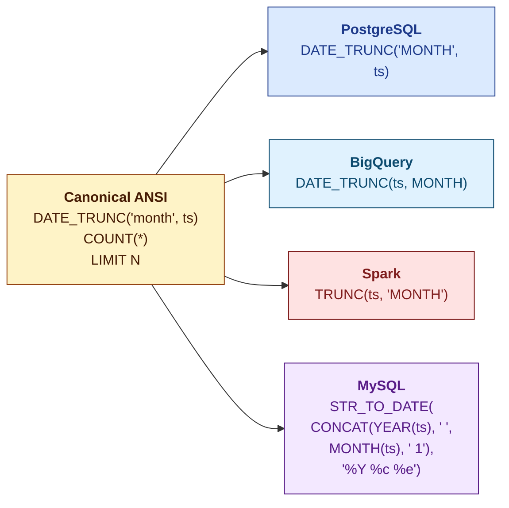
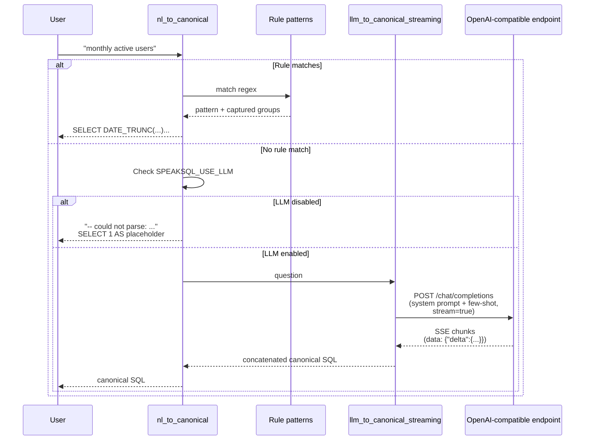
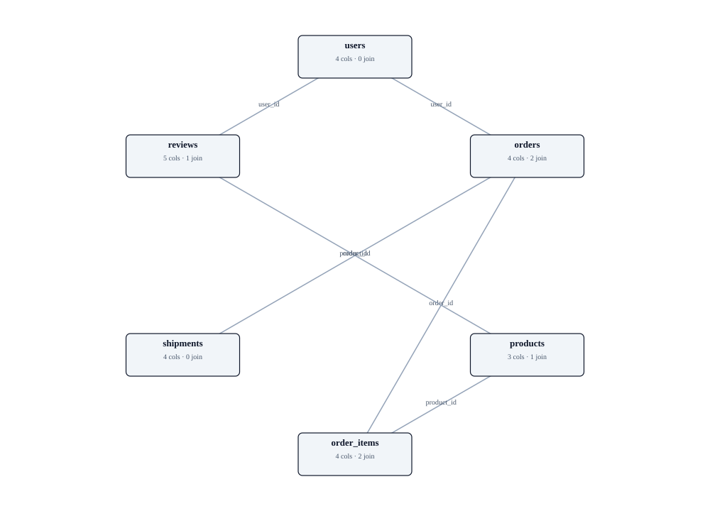
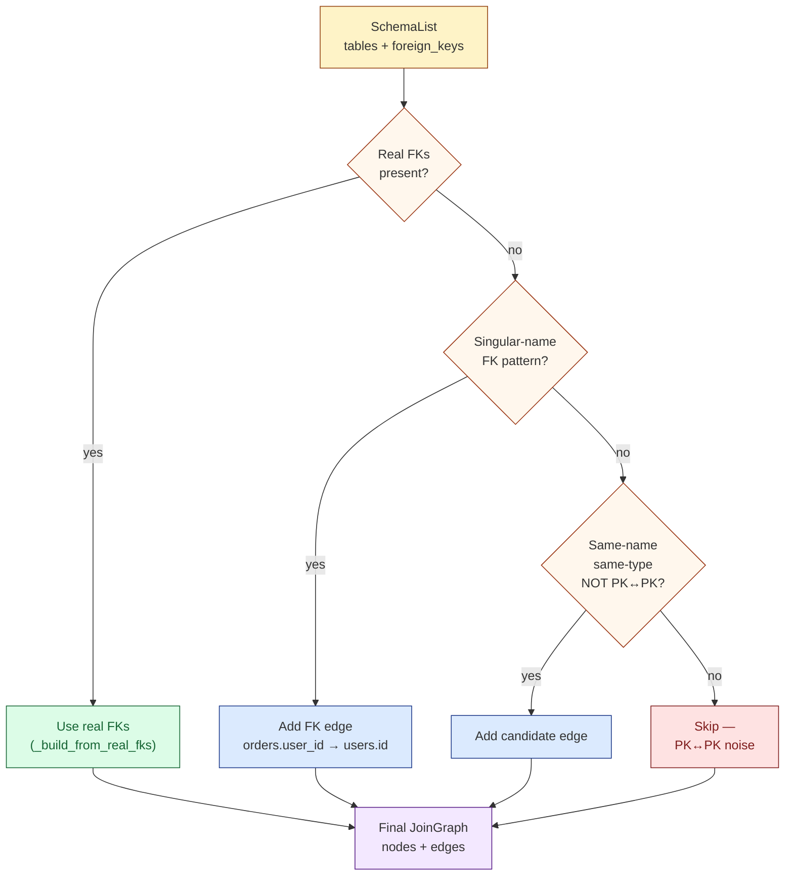
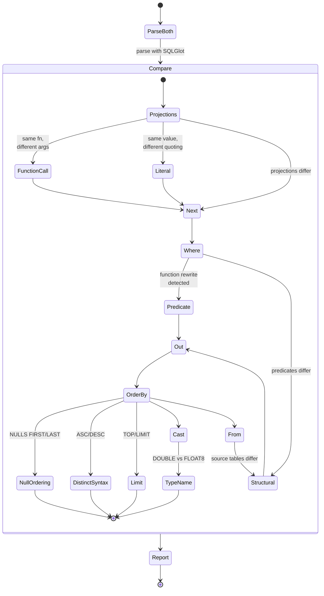
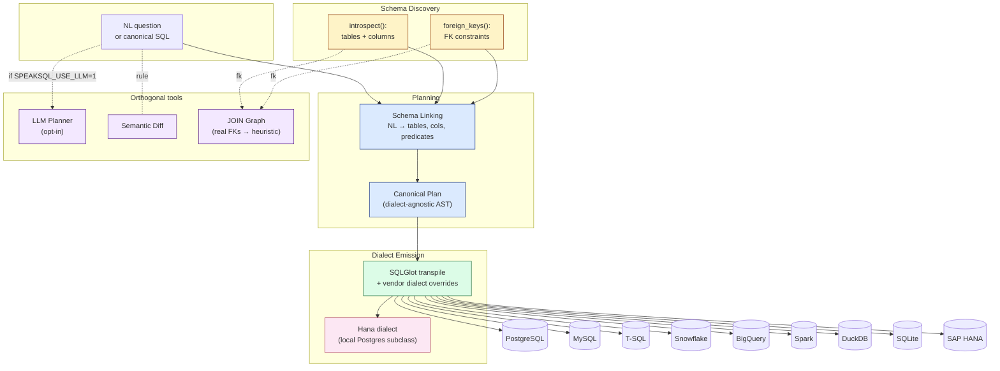

# SpeakSQL

> **Speak once. Query any dialect.**

A dialect-aware SQL transpiler for Python. Build a canonical ANSI query plan
once, emit correct syntax for **PostgreSQL, MySQL, SQL Server, Snowflake,
BigQuery, Databricks, DuckDB, SQLite,** and **SAP HANA** — without writing
per-dialect SQL by hand.

[](https://github.com/rollroyces/speaksql/actions/workflows/ci.yml)
[](https://github.com/rollroyces/speaksql)
[](LICENSE)
[](https://github.com/tobymao/sqlglot)

---

## Why SpeakSQL?

Every data team ends up writing the same query five different ways — once
per warehouse. **SpeakSQL** lets you write it once in canonical ANSI SQL
and transpile it into idiomatic SQL for each target.



*One canonical source → four dialect-specific outputs, with no
copy-paste and no dialect-specific debugging.*

---

## Features

- 🌍 **9 supported dialects** — Postgres, MySQL, T-SQL, Snowflake, BigQuery,
  Spark/Databricks, DuckDB, SQLite, SAP HANA.
- 🧱 **Canonical plan + dialect emission** — built on [SQLGlot](https://github.com/tobymao/sqlglot)
  for battle-tested parsing.
- 🛠️ **Three surfaces** — Python library, CLI, and FastAPI service from one
  install.
- 🔌 **Live backends** — actually execute transpiled SQL against SQLite,
  DuckDB, Postgres, MySQL, SQL Server, Snowflake, BigQuery, or Spark/
  Databricks. Real FK constraints are read from the database and used
  to build JOIN graphs.
- 🧠 **LLM planner** — rule-based by default; opt-in via
  `SPEAKSQL_USE_LLM=1` for any OpenAI-compatible endpoint (no SDK).
- 🔍 **Semantic diff** — compare two SQL strings and see *why* they're
  different (NULLS FIRST/LAST, ASC/DESC, TOP/LIMIT, function-call rewrites,
  type aliases, structural). Not just textual.
- 🗺️ **JOIN graph visualizer** — self-contained HTML diagrams from schema
  + FK metadata.
- ✅ **159 tests passing** — unit + integration, including live SQLite
  and DuckDB roundtrips, fake-server SSE streaming, and WebSocket
  end-to-end frames.
- 🎯 **Honest about limits** — vendor dialect for HANA (upstream SQLGlot
  lacks one); BigQuery has no FK concept; no fabrication in NL→SQL.
- 📜 **Dual-licensed** — AGPL-3.0-or-later for open source, commercial
  license available.

---

## Install

```bash
pip install speaksql
```

**With extras:**

```bash
pip install speaksql[service]   # FastAPI + Uvicorn for the HTTP service
pip install speaksql[postgres]  # psycopg driver
pip install speaksql[mysql]     # PyMySQL driver
pip install speaksql[mssql]     # pymssql driver (SQL Server)
pip install speaksql[duckdb]    # in-process DuckDB driver (great for tests)
pip install speaksql[snowflake] # snowflake-connector-python
pip install speaksql[bigquery]  # google-cloud-bigquery
pip install speaksql[spark]     # PySpark (heavy; JVM required)
pip install speaksql[backends]  # all seven drivers above
pip install speaksql[dev]       # pytest + ruff + mypy
```

---

## Quick start

### Python library

```python
import speaksql

canonical = (
    "SELECT DATE_TRUNC('month', created_at) AS month, "
    "       country, SUM(amount) AS total "
    "FROM events "
    "GROUP BY month, country "
    "ORDER BY month, total DESC"
)

# One query → many dialects
result = speaksql.transpile(
    canonical,
    targets=("postgres", "bigquery", "snowflake", "tsql", "duckdb"),
)
for dialect, sql in result.items():
    print(f"--- {dialect} ---")
    print(sql)
```

**Sample output (BigQuery):**

```sql
SELECT
  DATE_TRUNC(created_at, MONTH) AS month,
  country,
  SUM(amount) AS total
FROM events
GROUP BY
  month,
  country
ORDER BY
  month,
  total DESC
```

### CLI

The CLI takes **natural language by default**. No `--sql` flag needed for
plain English:

```bash
# Natural language → all supported dialects
speaksql ask "monthly amount by country"
# → emits DATE_TRUNC GROUP BY for postgres, bigquery, snowflake, ...

# Canonical SQL → specific targets only (skip NL layer)
speaksql ask -d postgres -d snowflake --sql \
  "SELECT id, amount FROM events WHERE amount > 100"

# JSON output (for piping into other tools)
speaksql ask "top 5 country by amount" --json

# Transpile AND execute on a live backend
speaksql ask -d duckdb --sql \
  "SELECT SUM(amount) AS total FROM events" \
  --execute-on duckdb \
  --db-path /tmp/events.duckdb \
  --json

# Compare two SQL strings semantically
speaksql diff "SELECT id FROM t ORDER BY id ASC NULLS LAST" \
            "SELECT id FROM t ORDER BY id ASC" --json

# Build a JOIN graph from a SQLite database
speaksql graph ./analytics.sqlite --backend sqlite --html ./graph.html

# List supported dialects
speaksql dialects
```

| Subcommand | Purpose |
|---|---|
| `ask` | Transpile NL or canonical SQL to one or more dialects; optionally execute |
| `diff` | Compare two SQL strings semantically (NULLS, ASC/DESC, function rewrites, etc.) |
| `graph` | Build a JOIN graph from a SQLite/DuckDB file; emit JSON, text, or HTML |
| `dialects` | Print all supported dialect identifiers |

### HTTP service

```bash
pip install speaksql[service]
uvicorn speaksql.service:app --reload
```

The HTTP service takes **natural language** by default. No `is_sql` flag
required for plain English:

Transpile only — natural-language input:

```bash
curl -X POST http://localhost:8000/v1/ask \
  -H 'content-type: application/json' \
  -d '{
        "question": "monthly amount by country",
        "dialects": ["postgres", "snowflake", "bigquery"]
      }'
```

Transpile only — canonical SQL input (skip NL layer):

```bash
curl -X POST http://localhost:8000/v1/ask \
  -H 'content-type: application/json' \
  -d '{
        "question": "SELECT DATE_TRUNC('"'"'month'"'"', created_at) AS m, SUM(amount) AS total FROM events GROUP BY m",
        "is_sql": true,
        "dialects": ["postgres", "snowflake", "bigquery"]
      }'
```

Transpile **and execute** on a live backend (requires the matching driver extra):

```bash
curl -X POST http://localhost:8000/v1/execute \
  -H 'content-type: application/json' \
  -d '{
        "question": "SELECT DATE_TRUNC('"'"'month'"'"', created_at) AS m, SUM(amount) AS total FROM events GROUP BY m ORDER BY m",
        "is_sql": true,
        "backend": "duckdb",
        "db_path": "/tmp/events.duckdb"
      }'
```

Returns `row_count` + `rows` (capped at 100), with datetime/Decimal values
ISO-formatted for clean JSON parsing.

**Streaming via WebSocket** — connect to `ws://localhost:8000/v1/ask`,
send the same JSON payload, and receive a sequence of frames as the
canonical SQL is built and per-dialect transpilation completes:

```text
client → server: {"question": "monthly active users"}
server → client: {"type": "llm_token", "delta": "SELECT "}
server → client: {"type": "llm_token", "delta": "DATE_TRUNC("}
... (more llm_token frames if SPEAKSQL_USE_LLM=1 and the rule layer missed)
server → client: {"type": "canonical",  "sql": "SELECT ..."}
server → client: {"type": "transpile", "dialect": "postgres", "sql": "..."}
server → client: {"type": "transpile", "dialect": "snowflake", "sql": "..."}
server → client: {"type": "done"}
```

The WebSocket path is end-to-end async and is the recommended surface
for clients that want to show partial results as the LLM streams.

| Endpoint | Method | Purpose |
|---|---|---|
| `/v1/ask` | POST | Transpile SQL or NL to one or more dialects |
| `/v1/ask` | WebSocket | Streaming variant — receives `llm_token` / `canonical` / `transpile` / `done` frames |
| `/v1/execute` | POST | Transpile + execute on a live backend (sqlite/duckdb/postgres/mysql/mssql/snowflake/bigquery/spark) |
| `/v1/diff` | POST | Compare two SQL strings semantically; returns `{identical, differences}` |
| `/v1/graph` | POST | Build a JOIN graph from a SQLite/DuckDB file; returns JSON + HTML |
| `/v1/dialects` | GET | List supported dialect identifiers |

### Live backends

In addition to transpilation, SpeakSQL ships live-driver backends so you can
verify the emitted SQL against a real engine:

| Dialect | Install | Import |
|---|---|---|
| SQLite | (base install) | `from speaksql.backends import backend_for; backend_for("sqlite")` |
| DuckDB | `pip install speaksql[duckdb]` | `backend_for("duckdb")` |
| PostgreSQL | `pip install speaksql[postgres]` | `backend_for("postgres", host=..., dbname=..., user=..., password=...)` |
| MySQL | `pip install speaksql[mysql]` | `backend_for("mysql", host=..., user=..., password=..., database=...)` |
| SQL Server | `pip install speaksql[mssql]` | `backend_for("mssql", server=..., user=..., password=..., database=...)` |
| Snowflake | `pip install speaksql[snowflake]` | `backend_for("snowflake", user=..., password=..., account=..., warehouse=...)` |
| BigQuery | `pip install speaksql[bigquery]` | `backend_for("bigquery", project=...)` |
| Spark / Databricks | `pip install speaksql[spark]` | `backend_for("spark", master="local[*]", app_name="...")` |
| All seven | `pip install speaksql[backends]` | — |

Every backend implements the same `Backend` protocol: `introspect()` returns a
`SchemaList`, `execute(sql)` returns `list[tuple]`, `close()` shuts the
connection. Roundtrip example:

```python
import speaksql
from speaksql.backends import backend_for

be = backend_for("duckdb")  # or "sqlite", "postgres", ...
be.execute("CREATE TABLE events (id INT, amount DOUBLE)")
be.execute("INSERT INTO events VALUES (1, 100.0), (2, 200.0)")

canonical = "SELECT SUM(amount) AS total FROM events"
results = speaksql.transpile(canonical, targets=("duckdb",))
print(be.execute(results["duckdb"]))
# [(300.0,)]

schema = be.introspect()
for t in schema.tables:
    print(f"{t.schema}.{t.name}: {[c.name for c in t.columns]}")
# main.events: ['id', 'amount']
```

### FK-aware SQL generation

When you give SpeakSQL a real schema (via `Backend.introspect()` + `foreign_keys()`),
the rule-based planner becomes **schema-aware**: it tokenizes the question,
matches tokens against table and column names, uses the FK metadata to pull
in parent tables, and emits canonical SQL with the right JOINs.

```mermaid
flowchart LR
    Q[Question<br/>"monthly orders by user"]:::input
    S[Schema<br/>+ FK metadata]:::input
    P[plan_for_question]:::core
    H[SchemaHint<br/>tables, columns, joins]:::hint
    R[Rule patterns<br/>or LLM prompt]:::emit
    SQL[Canonical SQL<br/>+ JOIN clause]:::out

    Q --> P
    S --> P
    P --> H
    H --> R
    R --> SQL

    classDef input fill:#fef3c7,stroke:#92400e
    classDef core fill:#dbeafe,stroke:#1e3a8a
    classDef hint fill:#dcfce7,stroke:#166534
    classDef emit fill:#f3e8ff,stroke:#581c87
    classDef out fill:#fce7f3,stroke:#9d174d
```

```python
from speaksql.backends import backend_for
from speaksql.schema_aware import plan_for_question, joins_to_sql

be = backend_for("duckdb", path="./analytics.duckdb")
schema = be.introspect().with_foreign_keys(be.foreign_keys())
be.close()

hint = plan_for_question("monthly orders by user", schema)
print(hint.to_prompt_section())
# Tables:
#   orders ((no columns matched))
#   users ((no columns matched))
# Joins:
#   orders.user_id → users.id

print(joins_to_sql(hint.joins))
# JOIN users ON orders.user_id = users.id
```

`nl_to_canonical()` accepts the schema too:

```python
from speaksql.nl import nl_to_canonical

sql = nl_to_canonical("count of orders per user", schema=schema)
# SELECT "user", COUNT(orders) AS cnt
# FROM orders
# JOIN users ON orders.user_id = users.id
# GROUP BY "user"
```

The CLI auto-discovers FKs when you pass `--db-path`:

```bash
speaksql ask -d duckdb --db-path ./analytics.duckdb \
  "count of orders per user"
# → emits a SELECT with FROM orders JOIN users ON orders.user_id = users.id
```

When the question is too ambiguous for the rule layer, the **same** schema
hint is injected into the LLM system prompt so the LLM also benefits
from the FK metadata.

### LLM planner

The default NL→SQL planner in `speaksql.nl` is rule-based — three regex
patterns covering `count of X`, `top N X by Y`, and `monthly X by Y`. When
a query doesn't match, it returns a syntactically valid placeholder SQL
with the original question preserved as a comment. **No fabrication.**

The CLI and HTTP service take **natural language directly** — no flag
needed. If the rule layer matches, the LLM is bypassed entirely. If the
rule layer misses and `SPEAKSQL_USE_LLM=1`, the LLM kicks in as a
fallback.



**Streaming.** Both providers implement `stream(messages)` which yields
incremental text deltas via Server-Sent Events. SpeakSQL exposes this as
`llm_to_canonical_streaming(question)` — useful for the WebSocket
endpoint, which forwards each chunk as an `llm_token` frame.

For more flexible NL handling, set `SPEAKSQL_USE_LLM=1` and configure
a provider. SpeakSQL ships:

- `MockProvider` — returns canned canonical SQL for testing. The default.
- `OpenAICompatibleProvider` — POST to any OpenAI-shaped endpoint via
  stdlib `urllib`. No SDK required. Works with OpenAI, Together, Groq,
  OpenRouter, vLLM, Ollama, and local llama.cpp.

Env vars:

```bash
export SPEAKSQL_USE_LLM=1
export SPEAKSQL_LLM_BASE_URL=https://api.openai.com/v1
export SPEAKSQL_LLM_API_KEY=sk-...              # or OPENAI_API_KEY
export SPEAKSQL_LLM_MODEL=gpt-4o-mini
export SPEAKSQL_LLM_AUTH_HEADER=Authorization  # or x-api-key for Anthropic-style
export SPEAKSQL_LLM_AUTH_PREFIX='Bearer '
export SPEAKSQL_LLM_TIMEOUT_S=30
export SPEAKSQL_LLM_MAX_TOKENS=512
export SPEAKSQL_LLM_TEMPERATURE=0.0
```

Programmatic:

```python
import speaksql
from speaksql.llm import MockProvider, OpenAICompatibleProvider

# Mock (default; no network)
p = MockProvider()
sql = speaksql.llm_to_canonical("show all users", provider=p)

# Custom OpenAI-compatible endpoint
p = OpenAICompatibleProvider(
    base_url="https://api.together.xyz/v1",
    model="meta-llama/Llama-3-70b-chat-hf",
    api_key="...",
)
sql = speaksql.llm_to_canonical("monthly active users", provider=p)
```

An eval harness lives at `examples/llm_eval/run.py`. Run with the mock
provider to verify your prompt changes don't regress rule-based
behavior:

```bash
PYTHONPATH=src python examples/llm_eval/run.py
# 7/7 cases passed.
```

Pass `--provider openai` (with `SPEAKSQL_LLM_BASE_URL` set) to evaluate
against a real LLM.

### JOIN graph

Given a schema (from `Backend.introspect()`), SpeakSQL builds a JOIN
graph by **preferring real FK constraints** and falling back to a name
heuristic.

Example — a real SpeakSQL-rendered graph for an ecommerce schema
(users, orders, products, order_items, shipments, reviews) built from
the FK constraints the database declares:

<p align="center">
  <a href="docs/join_graph_example/index.html">
    
  </a>
</p>



Per-backend FK sources:

1. **Real FK constraints (preferred):** SQLite `PRAGMA foreign_key_list`,
   Postgres `information_schema.referential_constraints` joined with
   `key_column_usage`, DuckDB `duckdb_constraints()`, Snowflake
   `information_schema.referential_constraints` (informational only —
   often empty). BigQuery has no FK concept and returns `()`.
2. **Name-based heuristic (fallback):** when no FKs are available, we
   look for `{singular(other)}_id` matching the other table's PK. PK↔PK
   same-name noise is filtered out. Type mismatches disqualify.

CLI:

```bash
speaksql graph ./analytics.sqlite --backend sqlite --html ./graph.html
# 4 tables · 2 inferred joins (2 from declared FKs)
#   order_items <-> orders  via order_id
#   orders <-> users  via user_id
```

The HTML is self-contained — no JS, no external CSS, no CDN — and
embeds an SVG diagram plus a column listing. Service:

```bash
curl -X POST http://localhost:8000/v1/graph \
  -H 'content-type: application/json' \
  -d '{"db_path": "./analytics.sqlite", "backend": "sqlite"}'
# Returns {db_path, backend, nodes, graph, html}
```

Programmatic:

```python
import speaksql
from speaksql.backends import backend_for

be = backend_for("sqlite", path="./analytics.sqlite")
schema = be.introspect()
fks = be.foreign_keys()  # declared FK constraints
be.close()

g = speaksql.build_join_graph(schema.with_foreign_keys(fks))
# pass use_real_fks=False to force the name heuristic
print(g.to_dict())
```

### Semantic diff

Compare two SQL strings (possibly from different dialects) and see the
**semantic** differences — not just textual ones:



Categories detected:

- `function_call` (same function, different call form)
- `null_ordering` (NULLS FIRST/LAST)
- `distinct_syntax` (TOP vs LIMIT, ASC vs DESC)
- `type_name` (DOUBLE PRECISION vs FLOAT8)
- `literal` (same value, different quoting)
- `predicate` (different WHERE clause)
- `structural` (different tables/projections)

```python
import speaksql

# Same canonical query, transpiled to Postgres and BigQuery
postgres = "SELECT id FROM t ORDER BY id ASC NULLS LAST"
bigquery = "SELECT id FROM t ORDER BY id ASC"

diffs = speaksql.semantic_diff(postgres, bigquery, dialect_a="postgres", dialect_b="bigquery")
print(speaksql.format_diff(diffs))
```

Output:

```
1 semantic difference(s):
  1. [null_ordering] @ ORDER BY #0
     a: 'NULLS LAST'
     b: 'NULLS FIRST'  (null ordering differs)
```

CLI:

```bash
speaksql diff "SELECT id FROM t ORDER BY id ASC NULLS LAST" \
            "SELECT id FROM t ORDER BY id ASC" --json
```

Service:

```bash
curl -X POST http://localhost:8000/v1/diff \
  -H 'content-type: application/json' \
  -d '{"sql_a": "SELECT id FROM t ORDER BY id ASC NULLS LAST",
       "sql_b": "SELECT id FROM t ORDER BY id ASC"}'
# {"identical": false, "differences": [{"category": "null_ordering", ...}]}
```

---

## Supported dialects

| Dialect | Identifier | Aliases | Status | Live FK introspection |
|---|---|---|---|---|
| PostgreSQL | `postgres` | — | ✅ native + backend | ✅ `information_schema.referential_constraints` |
| MySQL | `mysql` | — | ✅ native + backend | ✅ `information_schema.key_column_usage` |
| SQL Server | `tsql` | `mssql`, `sqlserver` | ✅ native + backend | ✅ `sys.foreign_keys` |
| Snowflake | `snowflake` | — | ✅ native + backend | ✅ informational only — often empty |
| BigQuery | `bigquery` | — | ✅ native + backend | ❌ no FK concept in BigQuery DDL |
| Databricks / Spark | `spark` | `databricks` | ✅ native + backend | ❌ Spark catalog doesn't expose FK metadata |
| DuckDB | `duckdb` | — | ✅ native + backend | ✅ `duckdb_constraints()` |
| SQLite | `sqlite` | — | ✅ native + backend (bundled) | ✅ `PRAGMA foreign_key_list` |
| SAP HANA | `hana` | `saphana` | ✅ vendor (see [HANA dialect](#sap-hana-hana)) | ❌ not yet exposed |

### SAP HANA (`hana`)

SpeakSQL ships a vendor-side HANA dialect (`src/speaksql/dialects/hana.py`)
that subclasses SQLGlot's Postgres parser. Upstream SQLGlot does not yet
ship a HANA dialect, so we maintain one locally.

The HANA dialect:

- Inherits Postgres grammar (HANA is broadly ANSI-compatible)
- Removes Postgres's 2-arity `MAP` binding — HANA's `MAP(k1, v1, k2, v2, ...)`
  takes variable even-arity pairs
- Roundtrips HANA-specific functions through unchanged: `ADD_MONTHS`,
  `DAYS_BETWEEN`, `SECONDS_BETWEEN`, `SERIES_GENERATE_DATE`,
  `BINNING`, `TO_VARCHAR`, `IFNULL`, etc.

When upstream SQLGlot ships a real HANA dialect, this module either
inherits from it or becomes a thin shim — callers don't notice.

---

## Architecture



Three orthogonal tools complement the transpile pipeline:

- **LLM planner** — replaces the rule-based NL layer when
  `SPEAKSQL_USE_LLM=1`. Stdlib `urllib`, no SDK, OpenAI-compatible.
- **Semantic diff** — compares two SQL strings AST-aware.
- **JOIN graph** — uses real FKs first, name heuristic second.
  Self-contained HTML output.

* The canonical plan is dialect-agnostic — you write ANSI SQL once.
* The vendor dialects are narrow: only the things SQLGlot misses (HANA's
  `MAP` arity, T-SQL edge cases, BigQuery FK-less introspection). The
  rest of the work is done by SQLGlot.

---

## Development

```bash
git clone https://github.com/rollroyces/speaksql
cd speaksql
uv sync --all-extras
uv run pytest            # 159 tests
uv run ruff check src tests
uv run python examples/demo_all_dialects.py
PYTHONPATH=src python examples/llm_eval/run.py   # 7/7 cases
```

**Project layout:**

```
speaksql/
├── src/speaksql/
│   ├── core.py                # plan() / emit() / transpile()
│   ├── introspect.py          # SchemaList + ForeignKeyInfo
│   ├── nl.py                  # rule-based NL → canonical SQL (with LLM fallback)
│   ├── llm.py                 # LLMProvider, MockProvider, OpenAICompatibleProvider
│   ├── schema_aware.py        # FK-aware planner (plan_for_question, joins_to_sql)
│   ├── diff.py                # semantic_diff + DiffEntry
│   ├── graph.py               # JOIN graph builder + HTML renderer
│   ├── cli.py                 # `speaksql` command (ask, diff, graph, dialects)
│   ├── service.py             # FastAPI app (optional)
│   ├── exceptions.py
│   ├── backends/              # per-dialect DB drivers (SQLite, DuckDB,
│   │                          #   Postgres, MySQL, MSSQL, Snowflake,
│   │                          #   BigQuery, Spark/Databricks)
│   └── dialects/              # vendor dialects (hana.py)
├── tests/                     # 159 tests across 26 files
├── examples/
│   ├── demo_all_dialects.py
│   └── llm_eval/              # eval harness + eval_set.jsonl
└── .github/workflows/         # CI: Python 3.11, 3.12, 3.13
```

---

## Roadmap

All roadmap items from the original v0.1 launch are shipped:

- [x] ~~Real HANA dialect~~ — shipped via `src/speaksql/dialects/hana.py`
      (vendor dialect subclassing Postgres)
- [x] ~~Postgres / Snowflake / BigQuery / DuckDB backends~~ — shipped
      via per-dialect extras (`[postgres]`, `[duckdb]`, `[snowflake]`,
      `[bigquery]`, `[backends]`)
- [x] ~~LLM-backed NL planner behind a feature flag~~ — shipped via
      `src/speaksql/llm.py` (`SPEAKSQL_USE_LLM=1`)
- [x] ~~Semantic diff mode between two dialect emissions~~ — shipped
      via `src/speaksql/diff.py` (`speaksql diff`, `/v1/diff`)
- [x] ~~JOIN graph visualizer for the linked schema~~ — shipped via
      `src/speaksql/graph.py` (`speaksql graph`, `/v1/graph`)
- [x] ~~Read real FK constraints from `information_schema.referential_constraints`
      instead of name heuristics~~ — shipped; SQLite `PRAGMA`, Postgres
      `information_schema`, DuckDB `duckdb_constraints()`, Snowflake
      `information_schema`, BigQuery (no-op)
- [x] ~~MySQL and SQL Server backends (currently transpile-only)~~ —
      shipped; PyMySQL + pymssql respectively
- [x] ~~Streaming LLM provider for long SQL generation~~ — shipped via
      `OpenAICompatibleProvider.stream()` (SSE) and
      `llm_to_canonical_streaming()`
- [x] ~~WebSocket `/v1/ask` endpoint with partial-response streaming~~ —
      shipped; emits `llm_token` / `canonical` / `transpile` / `done`
      frames incrementally
- [x] ~~Databricks / Spark backend (currently transpile-only)~~ —
      shipped; PySpark driver with `master="local[*]"` for testing or
      `sc://...databricks.com:443/...` for Databricks Connect
- [x] ~~FK-aware SQL generation (use graph knowledge to choose joins)~~
      — shipped via `speaksql.schema_aware.plan_for_question()`;
      auto-enabled in CLI when `--db-path` is given

New ideas being considered:

- [ ] Custom Snowflake / BigQuery / HANA vendor overrides (functions,
      types, syntactic idioms)
- [ ] Multi-hop JOIN path planning (currently only direct edges)

---

## Contributing

Issues and PRs welcome — please open one at
[github.com/rollroyces/speaksql/issues](https://github.com/rollroyces/speaksql/issues).
For significant changes, file an issue first so we can agree on scope.

---

## License

**AGPL-3.0-or-later** — see [LICENSE](LICENSE).

A commercial license is available for teams who want to embed SpeakSQL in
proprietary products without the AGPL obligations.
Contact Royce for terms.

---

<p align="center">
  <sub>Built with SQLGlot · Tested on Python 3.11, 3.12, 3.13 · 159 tests green</sub>
</p>